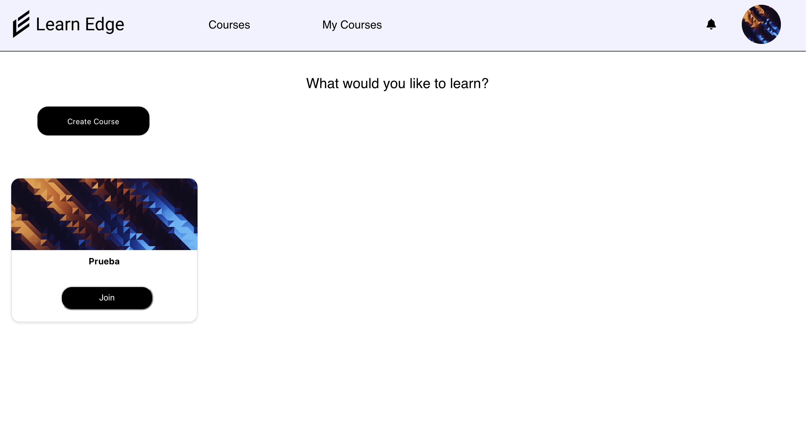

<a name="readme-top"></a>

<div align="center">
  <a href="https://www.linkedin.com/in/jose-miguel-bravo-m%C3%A9ndez-7bb5bb21b/">
    
  </a>
</div>

<!-- Logo -->
<br />
<div align="center">
  
  <p align="center">
    Welcome to my company project!
  </p>
</div>

<!-- TABLE OF CONTENTS -->
<details>
  <summary>Table of Contents</summary>
  <ol>
    <li>
      <a href="#about-the-project">About The Project</a>
      <ul>
        <li><a href="#built-with">Built With</a></li>
      </ul>
    </li>
    <li><a href="#roadmap">RoadMap</a></li>
    <li><a href="#figma">Figma</a></li>
    <li><a href="#requirements">Requirements</a></li>
    <li><a href="#backend">Backend</a></li>
    <li><a href="#install-mongodb">Install MongoDB</a></li>
    <li><a href="#diagrams">Diagrams</a></li>
    <li><a href="#user-manual">User Manual</a></li>
    <li><a href="#postman">PostMan</a></li>
    <li><a href="#frontend">Frontend</a></li>
    <li><a href="#app-guide">App Guide</a></li>
    <li><a href="#icons-and-components">Icons and Components</a></li>
    <li><a href="#repository">Repository</a></li>
    <li><a href="#technologies-comparison">Technologies Comparison</a></li>
    <li><a href="#ussability-and-accesibility">Ussability and Accesibility</a></li>
    <li><a href="#thoughts-and-conclussions">Thoughts and conclussions</a></li>
  </ol>
</details>

## About The Project

LearnEdge is a Online Course app.
Design for Mitca Studios.

Why I choose this project:
* The reason I chose this kind of project is because the company that i'm on works with projects for education so I thought what's better than a Online Course app :smile:

The idea of the project is simple the users are able to create their accounts as a students or teachers and depend in what role you choose you will be able to create courses and add content to them (teacher) or join courses and see their content (students) 

<p align="right">(<a href="#readme-top">back to top</a>)</p>

## Built With

This is the technologies that I had to use for this project, company chose.

[![Express][Express.js]][Express-url]
[![React][React.js]][React-url]
[![Mongoose-ODM][Mongoose-ODM]][Mongoose-url]
[![Mongodb][Mongodb]][Mongodb-url]

<p align="right">(<a href="#readme-top">back to top</a>)</p>

## RoadMap

For this project I have followed the Roadmap from Git(Projects) as our theacher request, SCRUMS with our DAD teacher and instead of following the Roadmap given us at the beginning i follow my own which was doing one table and one frontend at a time.

<br></br>


## Figma

The prototype has been made in <a href="https://www.figma.com/file/avrlJiOeIneXq5CDVriOe9/Mitca?type=design&node-id=0-1&mode=design&t=VaqrBnWqjKm7dp3e-0">Figma.</a>
  
<p align="right">(<a href="#readme-top">back to top</a>)</p>

## Requirements

This is a personal project so this is my idea. There's a problem and to solve that problem will be the creation of an app of online courses for everyone either you are student or teacher.

In this app both roles will have an easy way to both study and create courses. Student not only can join courses but see their content and Teachers can create those courses and delete them, also they can upload content to the app for other teachers to use in their courses.

The users that are administrator are able to manage both users and course as well create new admins and new courses if needed.

In order be able to use this app you will need the follow app: 

 * Visual Studio Code
 * MongoDB Api
 * NodeJS
 * Git

## Backend

Let's start installing our project. First backend.
  
1. npm
    ```sh
      npm install npm@latest -g
    ```
2. Clone the repo
    ```sh
      git clone https://github.com/Canariiii/LearnEdge
    ```
3. Go to the dir backend/    
    ```sh
       cd learnedge/backend/
    ```
4. Install NPM packages
    ```sh
       npm install
    ```

## Install MongoDB

To install MongoDB API go to their <a href="https://www.mongodb.com/docs/manual/installation/">website</a>

## Diagrams
<h1>Tree Diagram</h1>
</img>
<h2>Data Model</h2>
<p>
  In this project the main CRUD is made in the model Courses because every single class has something to do with it. 
  
  As a nonSql database our AED teacher told us to do no more than 2 levels.

  There's 6 different classes on this project (User,admin,student,instructor,course and content), every one with their attributes and methods.

  User:
   * _id
   * username
   * email
   * password
   * phone
   * role
   * filename
  
  Student: 
   * _id
   * username
   * email
   * password
   * phone
   * role
   * filename
  
  Instructor:
   * _id
   * username
   * email
   * password
   * phone
   * role
   * filename

  Admin:
   * _id
   * username
   * email
   * password
   * phone
   * role
   * filename

  Courses:
   * title
   * description
   * filename
   * content
   * instructor
   * enrrolledStudents[]
  
  Content:
   * contentType
   * contentData
   * user

</p>
<h2>User Case<h2>
</img>


  
<p align="right">(<a href="#readme-top">back to top</a>)</p>

## PostMan

Here's is a link to see al the end-points working with <a href="https://documenter.getpostman.com/view/30153359/2s9YkkfNm5">PostMan</a> tool.

<p align="right">(<a href="#readme-top">back to top</a>)</p>

## Frontend

Once we have everything install in our backend, we can continue with the frontend.

1. Go to the dir backend/    
    ```sh
       cd learnedge/frontend/
    ```
2. Install NPM packages
    ```sh
       npm install
    ```

## App Guide

<h2>Log In and Sign Up Guide</h2>

Users will be able to create their account as both roles students and instructors. They won't be able to create account as admin because that won't be a wise thing to do. User if they want to be admin the actual admin is the one that can change the roles of others.

<h2>Users Guide</h2>

As I say before users are allowed to creat two of three of the roles (student and instructors).

If users create their account as students they will be able to join courses and see the content inside of them. Students can join multiple courses at the time not only one. Every user dispite their role can do their own CRUD of their profile. Student also will have their own Active Course page where shows a list of the courses that they are on and there is where they will be able to exit the course.

If users choose to be instructors they will be able not only to create courses but upload content as well. Like students, instructors have an Active Course where they can erease the courses that their are instructor of and edit them.

The admin user which at first theres only one is able to manage both users and courses.

<h3>Courses Guide</h3>

Like I say before to create courses the user must have the role of instructor.

To create a course the instructor need to enter some parematers such as the title, description and a filename(a course picture).

To add content to their course the instructor need to create a content first unless they already have content created. Once the content is uploaded the instructor needs to go to the course that they want to add that content in and do a update of that course.

<h3>Content Guide</h3>

To create content the instructor needs to go to his personal profile page and clic on the Upload Content button and just fill the form which is only an input type file choose the content and post it.

<h3>Admin Guide</h3>

The users with admin role will be able to manage everything on the app. To make that happen in their personal page there's a manage button that takes to the Users CRUD and Courses CRUD. Once there the admins can choose if they want to manage the users or the courses.

## User Manual

Here is the user <a href="backend/public/img/Usual-Manual-LearnEdge.pdf">manual</a>.

## Icons and Components

The icons used in the app are from <a href="https://ant.design/components/icon">Ant Design</a> and <a href="https://fontawesome.com/icons">FontAwesome</A>.

Components used are from <a href="https://ant.design/components/overview">Ant Design</a>.

<p align="right">(<a href="#readme-top">back to top</a>)</p>

## Repository

I have been working with develop branch and issue branches, each issue branch destinated for the issues posted in the Roadmap that I showed <a href="#roadmap">here</a>. 

The main branch is called "<a href="https://github.com/Canariiii/LearnEdge">main</a>".

<p align="right">(<a href="#readme-top">back to top</a>)</p>

## Technologies Comparison

<h3>Application Web</h3>

Advantages:

   * Universal Access: The application can be accessed from any web browser, making it easily accessible for users across different devices and platforms.
   * Centralized Updates: Updates are implemented on the server, ensuring that users always get the latest version without the need to download or install anything.
   * Simplified Development: Traditional web development often involves widely known technologies and skills, making it easier to find developers and resources.

Disadvantages:

   * Connection Dependency: Most web applications require an internet  connection to function properly.
   * Limited Offline Experience: Offline functionality may be limited, depending on the nature of the application and how it's implemented.


<h3>Hibryd Application</h3>

Advantages:

   * Multiplatform Compatibility: Hybrid applications can run on different platforms, such as iOS and Android, using a shared codebase.
   * Access to Device Features: They can leverage specific device features like the camera or GPS.

Disadvantages:

   * Limited Performance: Compared to native applications, hybrids may experience slightly lower performance.
   * Framework Dependency: Hybrid apps may depend on frameworks that can change or become obsolete, impacting long-term sustainability.

<h3>Progressive Application Web (PWA) </h3>

Advantages:

   * Works Offline: PWAs can function even when there's no internet connection, enhancing the user experience.
   * Automatic Updates: They update automatically when there's a connection, ensuring users always have the latest version.
   * Storeless Installation: PWAs can be installed directly from the browser without the need for an app store.

Disadvantages:

   * Functionality Limitations: Some device features may not be accessible to PWAs compared to native apps.

Comparison with React, Express, Mongoose, and MongoDB:

   * React: It's a JavaScript library for building user interfaces. It can be used in web and hybrid applications and is compatible with PWA development.

   * Express: It's a Node.js framework commonly used to build web applications and servers. It can be part of a traditional web app or a PWA.

   * Mongoose: It's an Object Document Mapper (ODM) library for MongoDB and Node.js, facilitating interaction with MongoDB databases.

   * MongoDB: It's a NoSQL database that integrates well with Node.js. It can be used in web and hybrid applications.

## Demo

For users to test the user admin is called ("ADMIN") and his password is ("josejose").

To test the other roles follow the <a href="#user-manual">user manual</a>.

## Ussability and Accesibility

Here I'm gonna explain how and why i design this app.

I tried to make it minimalist and easy to understand for everyone. 

For the color I have pick white for the background just like other app of learning.


The mesages shown to the user are front AntDesign  .

  * In the app:
  
  * Code (message for successfull login): 
  

Form with the enough requirements:


Is keyboard accesible.

Images with a logic alternative text: 


Good code structure:


Labels for buttons:


Navigate buttons to not used the browser: 


Compatibility with multiple browsers:

 * Firefox: 
 
 
 * Safari:
 

 * Microsoft Edge: 
 
 
Avaible for Mobile screens:


It's easy to understand for everybody for example if you are instructor:

 * Create Course:
 
 

If you are student:

 * Join Course:
 

## Thoughts and conclussions

To be my first time that I do a "proper" professional full-stack application from scratch has been fun and hard because I had to use a technology that I never used before like MongoDB but to be fair it would it have been even harder if I had to use an SQL database. 
But dispite that and been honest I would still choose SQL.


[Express.js]: https://img.shields.io/badge/express.js-000000?style=for-the-badge&logo=express&logoColor=white
[Express-url]: https://expressjs.com/
[React.js]: https://img.shields.io/badge/React-20232A?style=for-the"-badge&logo=react&logoColor=61DAFB
[React-url]: https://reactjs.org/
[Mongoose-ODM]: https://img.shields.io/badge/mongoose-FFA500?style=for-the-badge&logo=mongoose&logoColor=white
[Mongoose-url]: https://mongoosejs.com/
[Mongodb]: https://img.shields.io/badge/mongodb-47A248?style=for-the-badge&logo=mongodb&logoColor=white
[Mongodb-url]: https://www.mongodb.com/